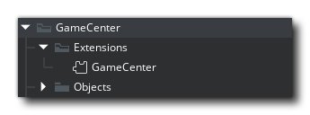
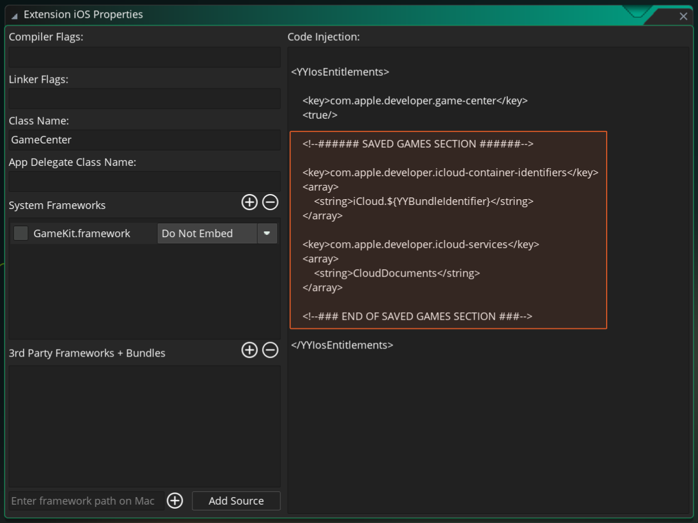
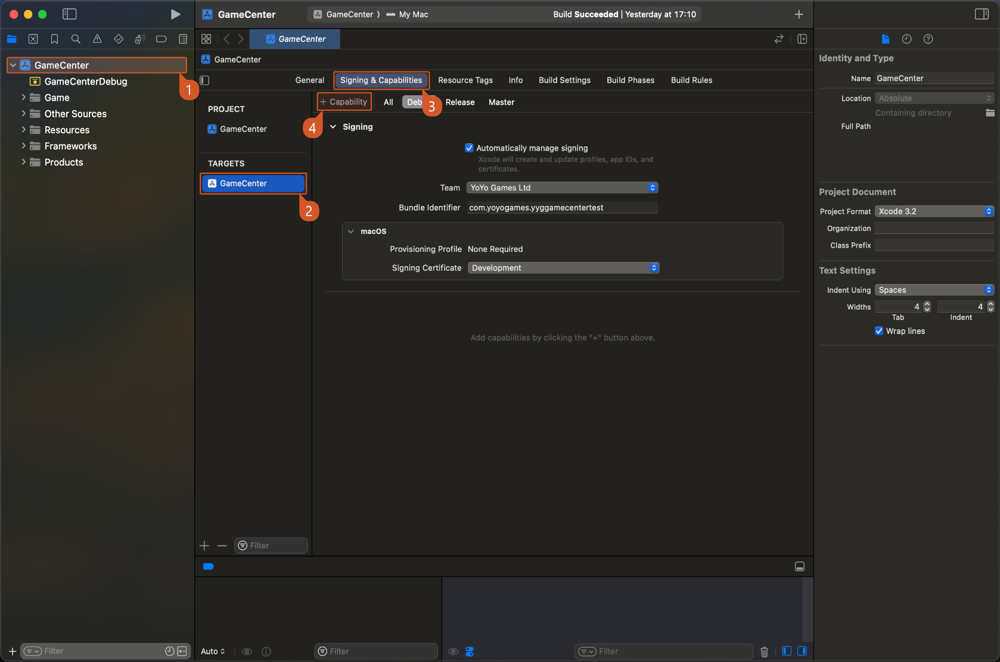
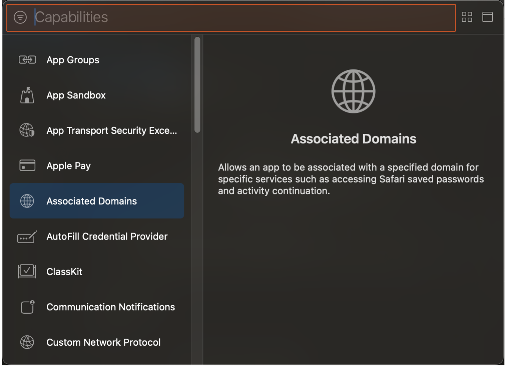
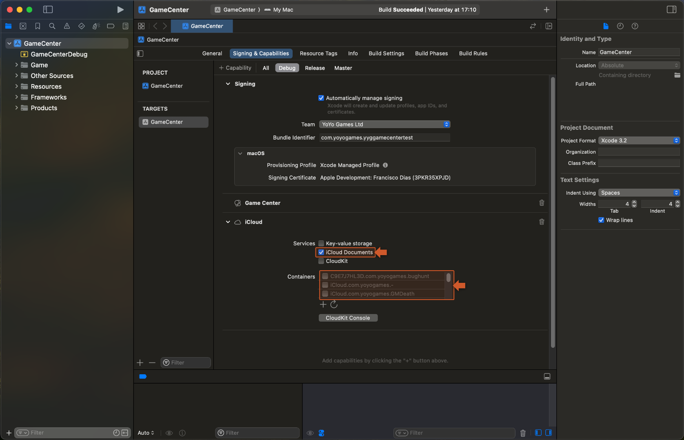

@title Setup

# Setup

The Apple GameCenter extension is to be used alongside your Apple Developer account ([App Store Connect webpage](https://appstoreconnect.apple.com/)). All the required personal leaderboard ids and achievement ids should be managed from there.

1. For creating leaderboards follow this guide: [Adding Leaderboards](https://developer.apple.com/help/app-store-connect/configure-game-center/configure-leaderboards)
2. For creating achievements follow the guide: [Adding Achievements](https://developer.apple.com/help/app-store-connect/configure-game-center/configure-achievements)
3. If you intend to use ${module.savedgames} functionality you need to create a new iCloud container using your Apple developer account dashboard ([dashboard link](https://icloud.developer.apple.com/dashboard/)).


## iOS

These are steps specific to the iOS export of the extension:

1. If you intend to use ${module.savedgames} functionality. You will also need to config your project following these steps:

  - Double click the **GameCenter** extension icon on your project: 

  

  - Click **iOS** line under **Extra Platforms**:

  
  
  - This will bring you to the code injection panel: 

  
  
  In this panel you need to make sure you have the following code in the `SAVED GAMES SECTION`:

```gml
	<key>com.apple.developer.icloud-container-identifiers</key>
	<array>
		<string>iCloud.${YYBundleIdentifier}</string>
	</array>

	<key>com.apple.developer.icloud-services</key>
	<array>
		<string>CloudDocuments</string>
	</array>
```

> [!IMPORTANT]
> If the code is already there and you are not using this functionality you should remove the section entirely.

## macOS

These are steps specific to the macOS export, in order to properly make use of GameCenter extension:

1. After exporting the project to macOS YYC using the IDE open the Xcode project in your mac. And follow the described steps in the image below:

  

2. In the **Capabilities** popup window search for **"GameCenter"** on the top bar and double click it to add it to your project:

  

3. If you intend to use ${module.savedgames} functionality, you will need to also add the **"iCloud"** capability.

> [!TIP]
> To add this capability follow step `2.` and search for **"iCloud"** and double click it to add it to your project.

  

There are some final options you will need to configure when using this capability:

   * Enable - ✅ **iCloud Documents** - from the iCloud section.
   * Select the previously created iCloud container.
  
> [!TIP]
> You are also able to create a new iCloud container directly from XCode (using the `+` icon).