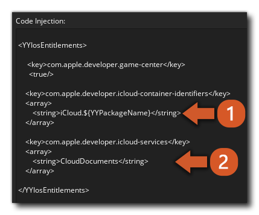

@title Setup

# Setup

The Apple GameCenter extension is to be used alongside your Apple Developer account ([App Store Connect webpage](https://appstoreconnect.apple.com/)). All the required personal leaderboard ids and achievement ids should be managed from there.

1. For creating leaderboards follow this guide: [Adding Leaderboards](https://developer.apple.com/help/app-store-connect/configure-game-center/configure-leaderboards)
2. For creating achievements follow the guide: [Adding Achievements](https://developer.apple.com/help/app-store-connect/configure-game-center/configure-achievements)
3. If you intend to use ${module.savedgames} functionality you need to create a new iCloud container using your Apple developer account dashboard ([dashboard link](https://icloud.developer.apple.com/dashboard/)).
This also needs to be set up inside the project itself, following these steps:

  - Double click the **GameCenter** extension icon on your project: 

  

  - Click **iOS** line under **Extra Platforms**:

  
  
  - This will bring you to the code injection panel: 

  
  
  In this panel you need to add/replace **(1)** which will configure the XCode project to use the name of the iCloud container you previously created and **(2)** this will make sure the iCloud Drive services permissions are automatically added.
